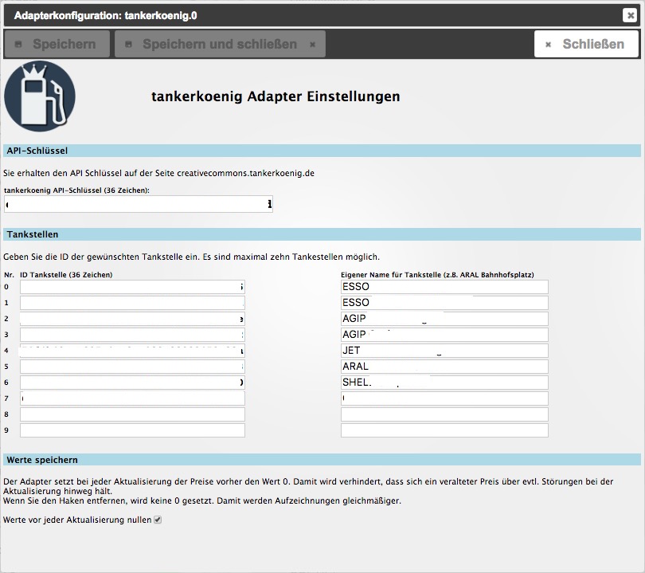

# ioBroker.tankerkoenig
=================

[](https://www.npmjs.com/package/iobroker.tankerkoenig)
[](https://www.npmjs.com/package/iobroker.tankerkoenig)

[](https://nodei.co/npm/iobroker.tankerkoenig/)

**Tests:** Linux/Mac: [](https://travis-ci.org/Pix---/ioBroker.tankerkoenig)
Windows: [](https://ci.appveyor.com/project/Pix---/ioBroker.tankerkoenig/)


## Beschreibung / Description
:de: Dieser Adapter liefert die Spritpreise für 10 festgelegte Tankstellen über den JSON Feed der Internetseite [tankerkoenig.de](https://creativecommons.tankerkoenig.de/#about). Die Daten werden in Objekte gespeichert, um in [ioBroker.vis](https://github.com/ioBroker/ioBroker.vis) verarbeitet zu werden.
Der Adapter verwendet die Seite prices.php, welche beim Quellserver von tankerkoenig.de durch die gleichzeitige Abfrage vieler Stationen und die Rückgabe von nur wenigen Daten insgesamt sehr viel weniger Datenverkehr verursacht, als die Abfrage über list.php (Umkreissuche) oder detail.php (Einzelabfrage einer Tankstelle). Auf die beiden anderen Formen der Abfrage wurde bewusst verzichtet. Somit ist keine Umkreissuche (zB sortiert nach Preis) und keine Lieferung genauerer Daten (Straße, Marke, Hausnummer, etc.) möglich. Die jeweils günstigste Tankstelle für die drei Spritsorten E5, E10 und Diesel werden in einem separaten Kanal gespeichert.

## Einstellungen / Configuration
### API-Key
Der API Schlüssel ist auf der [Seite von Tankerkönig](https://creativecommons.tankerkoenig.de/#about) erhältlich. Die 36stellige Zeichenkette muss hier eingetragen werden.

### Tankstellen
Es können bis zu 10 Tankstellen abgefragt werden. Dazu ist die Eingabe der Tankstellen ID nötig. Die ID für jede Tankstelle erhält man auf tankerkoenig.de. Sie ist ebenfalls 36stellig.
Zusätzlich kann ein eigener Name für die Station hinterlegt werden. Bei der Eingabe können Zeilen frei gelassen werden (um später ein weitere Tankstelle einzufügen oder nach dem Löschen einer Station).


### Werte nullen
Sollte die Verbindung zum Server nicht funktionieren, verhindert das Löschen der Werte in den Datenpunkte (Reset bzw. nullen), dass veraltete Werte vorgehalten werden. Dieser Reset kann in den Adaptereinstellungen ausgeschaltet werden, um flüssigere History-Daten zu erhalten.

## Aktivierung / Schedule
Der Adapter startet alle 5min. Die Daten des Quellfeeds werden vom Server bei tankerkoenig.de nur alle 4min aktualisiert. 

##  Datenpunkte / Datapoints
Jeder der zehn Kanäle des Feeds produziert für jede der drei Spritsorten E5, E10 und Diesel jeweils drei Datenpunkte:
* feed (Preis mit drei Dezimalstellen als Number)
* short (Preis mit zwei Dezimalstellen (ungerundet) als String)
* 3rd (dritte Dezimalstelle des Preises zur Darstellung der Hochzahl in VIS)
* combined (fertig HTML formatiert mit Preis und hochgestellter dritter Dezimalstelle oder ggf. Öffnungsstatus ["closed"/"not found"] zur einfachen Darstellung mit VIS HTML Widget)


Ausserdem werden noch zwei Datenpunkte gespeichert
* status (Station geöffnet?)
* name (vom Nutzer vergebener Name der Tankstelle)

Zusätzlich werden noch den die günstigsten Tankstellen aus der Liste in die Kanäle ermittelt
* cheapest.E5
* chepest.E10
* cheapest.diesel

Innerhalb dieser Kanäle ist die jeweils günstigste Tankstelle für die genannte Spritsorte angelegt. Bieten mehrere Tankstellen einen Treibstoff zum gleichen Preis an, wird die Station ausgegeben, die in den Einstellungen zuerst/ganz oben eingetragen wurde.

Es werden insgesamt 168 Werte geschrieben.

## VIS Nutzung
Der Datenpunkt combined lässt sich in VIS mit diesem Widget darstellen
```
[{"tpl":"tplHtml","data":{"visibility-cond":"==","visibility-val":1,"refreshInterval":"0","gestures-offsetX":0,"gestures-offsetY":0,"signals-cond-0":"==","signals-val-0":true,"signals-icon-0":"/vis/signals/lowbattery.png","signals-icon-size-0":0,"signals-blink-0":false,"signals-horz-0":0,"signals-vert-0":0,"signals-hide-edit-0":false,"signals-cond-1":"==","signals-val-1":true,"signals-icon-1":"/vis/signals/lowbattery.png","signals-icon-size-1":0,"signals-blink-1":false,"signals-horz-1":0,"signals-vert-1":0,"signals-hide-edit-1":false,"signals-cond-2":"==","signals-val-2":true,"signals-icon-2":"/vis/signals/lowbattery.png","signals-icon-size-2":0,"signals-blink-2":false,"signals-horz-2":0,"signals-vert-2":0,"signals-hide-edit-2":false,"html":"<span style=\"font-size: 80%; padding: 0 20px 0 5px;\">Diesel</span>{tankerkoenig.0.stations.0.diesel.combined}"},"style":{"left":"634px","top":"745px","z-index":"20","width":"228px","height":"36px","background-color":"","color":"rgba(225,225,225,1)","font-size":"30px","text-align":"center","background":"rgba(250,0,0,0.1)"},"widgetSet":"basic"}]
```
Der Inhalt des Datenpunktes "combined" wird mit einer CSS-Klasse übergeben. Die Klassen sind "station_open","station_closed" und "station_notfound". Durch die Verwendung von CSS-Definitionen im VIS Editor können so (nicht nur farblich) unterschiedliche Darstellungen für die Zustände "geöffnet" (zB normal), "geschlossen" (zB rote Schrift) und "nicht gefunden" (zB gelbe Schrift) erzielt werden.
```
.station_open {
    color: blue; 
}
.station_closed {
    color: red !important; /* !important kann ggf. weggelassen werden */
}
.station_notfound {
    color: yellow !important; /* !important kann ggf. weggelassen werden */
}

/* € sign */
.station_combined_euro {
    font-family: Times;
    font-size: 80%;
}
```


## Changelog
### 1.0.2 (2017-01-04)
* (apollon77) TravisCI added

### 1.0.1 (2016-12-20)
* (pix) reset to zero issue fixed

### 1.0.0 (2016-10-08)
* (pix) reset values to zero before each refresh now can be ticked off. 

### 0.1.2 (2016-07-05)
* (pix,jens-maus) whitespaces between price and € sign 

### 0.1.1 (2016-07-05)
* (pix) € appearance in datapoints __combined__ is customizable through css now (thanx jens-maus)

### 0.1.0 (2016-06-12)
* (pix) first version for npm
* (pix) settings window

### 0.0.8 (2016-06-09)
* (pix) Adapter.stop() fixed

### 0.0.7 (2016-06-09)
* (pix) New channels and values for cheapest station created

### 0.0.6 (2016-06-08)
* (pix) Short prices now string

### 0.0.5 (2016-06-08)
* (pix) Channels added for stations 2 to 10
* (pix) Readme corrected (CSS code example)
* (pix) no more log.warn if station is closed
* (pix) scheduled starting improved

### 0.0.4 (2016-06-01)
* (pix) HTML Code in Datapoint "combined" corrected

### 0.0.3 (2016-06-01)
* (pix) Datapoint "combined" with CSS class for status
 
### 0.0.2 (2016-06-01)
* (pix) Datapoint "combined"

### 0.0.1 (2016-05-31)
* (pix) Adapter created

## Roadmap
* State HTML Table 
* State JSON Table for VIS JSON table widget
* optional price trend through CSS class
* TRAVIS Check


## License

The MIT License (MIT)

Copyright (c) 2016 pix

Permission is hereby granted, free of charge, to any person obtaining a copy
of this software and associated documentation files (the "Software"), to deal
in the Software without restriction, including without limitation the rights
to use, copy, modify, merge, publish, distribute, sublicense, and/or sell
copies of the Software, and to permit persons to whom the Software is
furnished to do so, subject to the following conditions:

The above copyright notice and this permission notice shall be included in all
copies or substantial portions of the Software.

THE SOFTWARE IS PROVIDED "AS IS", WITHOUT WARRANTY OF ANY KIND, EXPRESS OR
IMPLIED, INCLUDING BUT NOT LIMITED TO THE WARRANTIES OF MERCHANTABILITY,
FITNESS FOR A PARTICULAR PURPOSE AND NONINFRINGEMENT. IN NO EVENT SHALL THE
AUTHORS OR COPYRIGHT HOLDERS BE LIABLE FOR ANY CLAIM, DAMAGES OR OTHER
LIABILITY, WHETHER IN AN ACTION OF CONTRACT, TORT OR OTHERWISE, ARISING FROM,
OUT OF OR IN CONNECTION WITH THE SOFTWARE OR THE USE OR OTHER DEALINGS IN THE
SOFTWARE.
