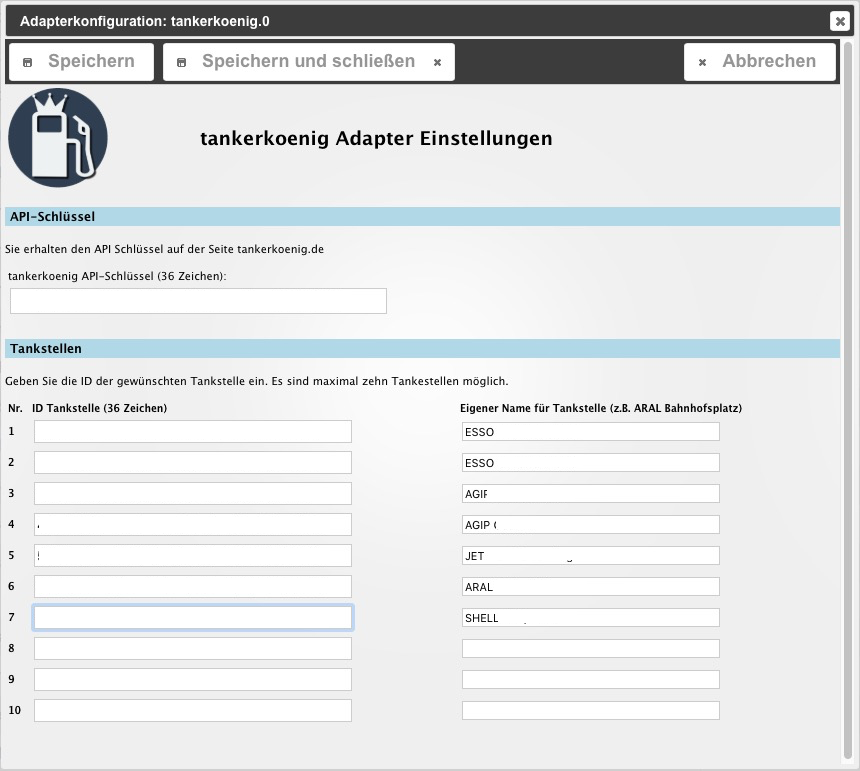

# ioBroker.tankerkoenig
=================

## Beschreibung / Description
:de: Dieser Adapter liefert die Spritpreise für 10 festgelegte Tankstellen über den JSON Feed der Internetseite [tankerkoenig.de](https://creativecommons.tankerkoenig.de/#about). Die Daten werden in Objekte gespeichert, um in [ioBroker.vis](https://github.com/ioBroker/ioBroker.vis) verarbeitet zu werden.
Der Adapter verwendet die Seite prices.php, welche beim Quellserver von tankerkoenig.de durch die gleichzeitige Abfrage viele Stationen und die Rückgabe von nur wenigen Daten insgesamt sehr viel weniger Datenverkehr verursacht, als die Abfrage über list.php (Umkreissuche) oder detail.php (Einzelabfrage einer Tankstelle). Auf die beiden anderen Formen der Abfrage wurde bewusst verzichtet. Somit ist keine Umkreissuche (zB sortiert nach Preis) und keine Lieferung genauerer Daten (Straße, Marke, Hausnummer, etc.) möglich.

## Einstellungen / Configuration
### API-Key
Der API Schlüssel ist auf der Seite on Tankerkönig erhältlich. Die 16stellige Zeichenkette muss hier eingetragen werden.

### Tankstellen
Es können bis zu 10 Tankstellen abgefragt werden. Dazu ist die Eingabe der Tankstellen ID nötig. Die ID für jede Tankstelle erhält man auf tankerkoenig.de
Zusätzlich kann ein eigener Name für die Station hinterlegt werden.

## Aktivierung / Schedule
Der Adapter startet alle 5min. Die Daten des Quellfeeds werden vom Server bei tankerkoenig.de nur alle 4min aktualisiert.

##  Datenpunkte / Datapoints
Jeder der zehn Kanäle des Feeds produziert für jede der drei Spritsorten E5, E10 und Diesel jeweils drei Datenpunkte:
* feed (Preis mit drei Dezimalstellen)
* short (Preis mit zwei Deziamlstellen (ungerundet))
* 3rd (dritte Dezimalstelle des Preises zur Darstellung der Hochzahl in VIS)
Ausserdem werden noch zwei Datenpunkte gespeichert
* status (Station geöffnet?)
* name (vom Nutzer vergebener Name der Tankstelle)

## Changelog
### 0.0.1 (2016-05-31)
* (pix) Adapter created

## Roadmap
* State HTML Table 
* State JSON Table for VIS JSON widget

## License

The MIT License (MIT)

Copyright (c) 2016 pix

Permission is hereby granted, free of charge, to any person obtaining a copy
of this software and associated documentation files (the "Software"), to deal
in the Software without restriction, including without limitation the rights
to use, copy, modify, merge, publish, distribute, sublicense, and/or sell
copies of the Software, and to permit persons to whom the Software is
furnished to do so, subject to the following conditions:

The above copyright notice and this permission notice shall be included in all
copies or substantial portions of the Software.

THE SOFTWARE IS PROVIDED "AS IS", WITHOUT WARRANTY OF ANY KIND, EXPRESS OR
IMPLIED, INCLUDING BUT NOT LIMITED TO THE WARRANTIES OF MERCHANTABILITY,
FITNESS FOR A PARTICULAR PURPOSE AND NONINFRINGEMENT. IN NO EVENT SHALL THE
AUTHORS OR COPYRIGHT HOLDERS BE LIABLE FOR ANY CLAIM, DAMAGES OR OTHER
LIABILITY, WHETHER IN AN ACTION OF CONTRACT, TORT OR OTHERWISE, ARISING FROM,
OUT OF OR IN CONNECTION WITH THE SOFTWARE OR THE USE OR OTHER DEALINGS IN THE
SOFTWARE.
